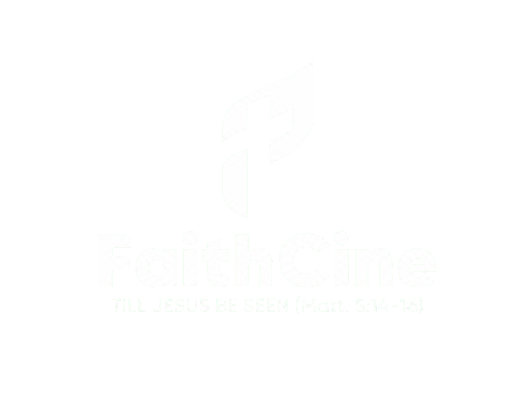

<div align="center">
  

# FaithCine

### Stories that point to Christ.

[](https://faithcine-selah.robust-mesa-9041.chatgpt.site)
[](https://react.dev/)
[](https://www.typescriptlang.org/)

Christ-centered films, stories, live experiences, learning, and community. Created from Africa for a wider world.

</div>

## Quick start

```bash
npm install
npm run dev
```

```bash
npm run typecheck
npm test
npm run build
```

## Publish to the Journal

Add a Markdown file to `content/blog/`. Put its images in `public/blog/<slug>/` and reference them with standard Markdown:

```md

```

New Markdown files are discovered automatically. See [`docs/BLOG_PUBLISHING.md`](docs/BLOG_PUBLISHING.md) for the complete two-minute workflow.

<div align="center">

**Till Jesus be seen · Matthew 5:14-16**

</div>
